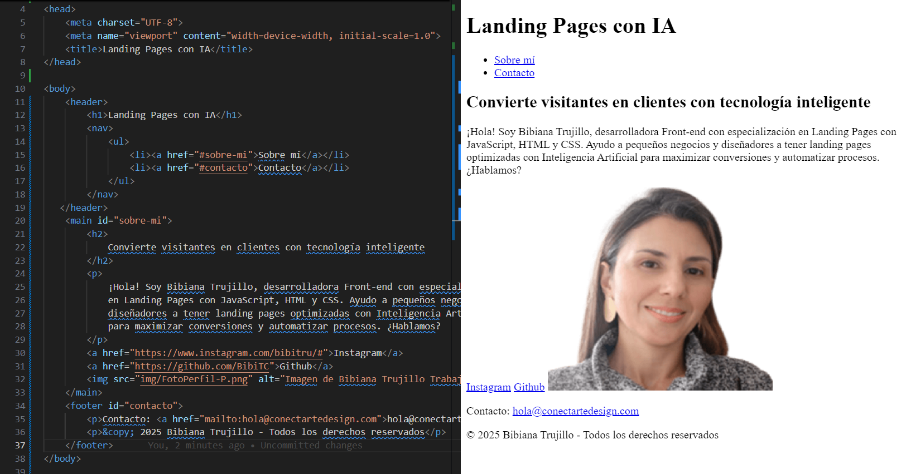
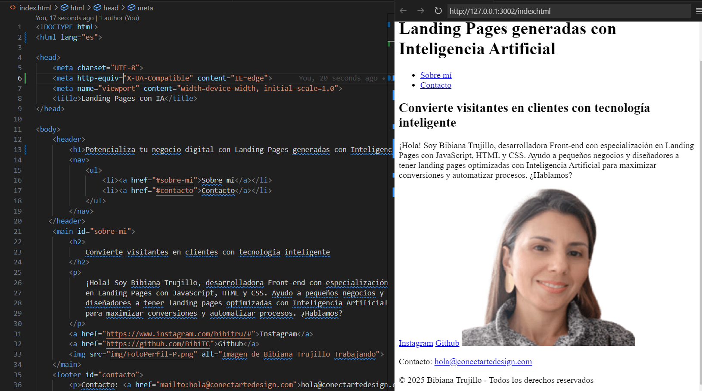
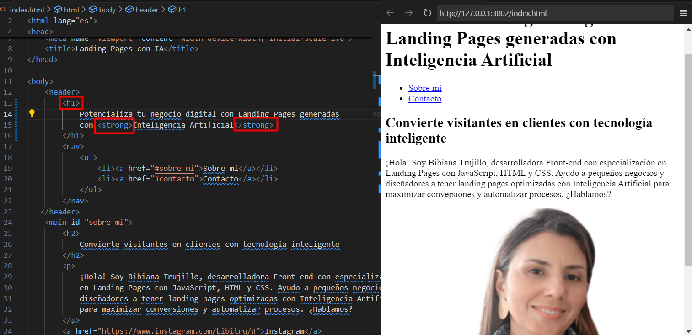
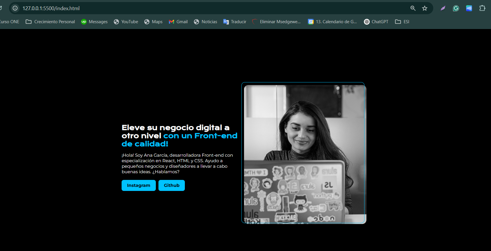

# HTML

# Construyendo la estructura HTML del portafolio

Acabas de recibir un diseño de página de portafolio de tu diseñadora. El desafío es transformar ese diseño en una página web funcional. Utilizando HTML, crea la estructura básica de la página. Recuerda incluir los elementos principales: un título principal, un subtítulo, dos botones (Instagram y Github), y un espacio para la imagen de la desarrolladora. Siéntete libre de personalizar el texto y la imagen para adaptarlos a tu portafolio personal.


## Estructurando la página con etiquetas semánticas

Ahora que entiendes la importancia de las etiquetas semánticas en HTML, es hora de aplicar ese conocimiento. Utiliza las etiquetas `header`, `main` y `footer` para estructurar tu página de portafolio. En el `header`, inserta un menú o un logotipo. En el `main`, agrega los elementos del portafolio como título, párrafo, botones e imagen. Por último, en el `footer`, coloca información como contacto o derechos de autor. Recuerda que cada elemento debe colocarse de manera lógica y estructurada para crear un sitio accesible y bien organizado.



## Entendiendo y aplicando las etiquetas meta

Explora el uso de las etiquetas `meta` en el encabezado de tu HTML. Cambia la etiqueta `lang` a "es", ajusta el `charset` a "UTF-8", agrega la etiqueta `meta` para la compatibilidad con Edge y otra para la configuración del `viewport`. Finalmente, cambia el título de tu página a algo relacionado con tu proyecto, por ejemplo, "Portafolio de [Tu Nombre]". Entiende cómo cada uno de estos cambios afecta la funcionalidad y accesibilidad de tu sitio.



## Insertando y formateando elementos en HTML

Ahora que ya tienes una base sólida sobre la estructura HTML, vamos a agregar y formatear elementos en tu página de portafolio. Sigue el diseño de Figma y comienza agregando un título (`<h1>`) con un resalte (`<strong>`) en una parte de él. Luego, inserta un párrafo (`<p>`) con una breve introducción sobre ti o tu empresa. Finalmente, agrega enlaces (`<a>`) a tus redes sociales o portafolios en línea, como Instagram y GitHub. Asegúrate de que cada elemento esté correctamente formateado y colocado según el diseño de Figma.



## Incorporando imágenes con etiquetas HTML

¡Ha llegado el momento de dar un toque visual a tu página! Elige una imagen que te represente a ti o tu trabajo y agrégala a tu página de portafolio utilizando la etiqueta ``. Recuerda incluir la propiedad `src` con la ruta de la imagen y `alt` con una descripción adecuada de la imagen. Esto no solo mejora la accesibilidad de tu sitio, sino que también ayuda a los motores de búsqueda a entender el contenido de la imagen. 

##Realizado en el punto 1.


# CSS
## Índice

1. [Estiliza tu HTML](#1-estiliza-tu-html)
2. [Practicando cómo utilizar el CSS](#2-practicando-como-utilizar-el-css)
   1. [Creando y vinculando el archivo CSS](#21-creando-y-vinculando-el-archivo-css)
   2. [Definiendo estilos básicos](#22-definiendo-estilos-basicos)
   3. [Estilizando con colores y formatos](#23-estilizando-con-colores-y-formatos)
   4. [Personalizando la página con CSS](#24-personalizando-la-pagina-con-css)
   5. [Aplicando estilos con CSS](#25-aplicando-estilos-con-css)
   6. [Personalizando enlaces](#26-personalizando-enlaces)

---

## 1. Estiliza tu HTML

En esta lección, aprendimos que con CSS podemos seleccionar elementos de HTML y asignar propiedades de CSS dentro de llaves para estilizar estos elementos.

Lo hicimos asignando un color de fondo negro a la etiqueta `<body>` a través de la propiedad `background-color` y cambiamos el color del texto a blanco utilizando la propiedad `color`, de la siguiente manera:

```css
body {
    background-color: black;
    color: white;
}
```

Ahora que ya sabes cómo crear una hoja de estilo para tu página HTML, es el momento de aplicar lo que aprendiste en esta lección. Modifica el estilo de la etiqueta `<body>`, prueba nuevos colores para el fondo y el texto, ¡y personaliza el proyecto a tu gusto! 😊

No olvides aplicar la etiqueta `<link rel="stylesheet" href="style.css">` dentro de la etiqueta `<head>` en tu archivo HTML para que tu estilo funcione correctamente.

---

## 2. Practicando cómo utilizar el CSS

### 2.1 Creando y vinculando el archivo CSS

Vas a crear un archivo CSS llamado `style.css` para estilizar una página web. Después de crear el archivo, tu objetivo es vincular este archivo CSS al HTML. Para lograrlo, usarás la etiqueta `<link>` dentro de la etiqueta `<head>` del documento HTML, especificando la ruta del archivo CSS. Este proceso es crucial para que los estilos definidos en CSS se apliquen a la página HTML.

### 2.2 Definiendo estilos básicos

En el archivo CSS, define el color de fondo del cuerpo de la página (`<body>`) como índigo (`indigo`) y el color del texto como blanco (`white`). Guarda los cambios y verifica en el navegador si el fondo de la página es índigo y el texto es blanco.

### 2.3 Estilizando con colores y formatos

Te han desafiado a dar vida a una página web que actualmente solo tiene HTML. Tu tarea es utilizar CSS para agregar colores y formatos a los elementos de la página, inspirándote en un diseño específico proporcionado en Figma. Concéntrate en seleccionar colores adecuados para fondos, textos y bordes, además de aplicar estilos a botones y encabezados para hacerlos visualmente atractivos. Puedes usar como referencia esta [tabla de nombres de colores](https://www.w3schools.com/colors/colors_names.asp).



### 2.4 Personalizando la página con CSS

Imagina que estás trabajando en un proyecto web y ha llegado el momento de darle vida a tu página con colores, formas y estilos. Tu tarea es crear un archivo CSS para estilizar una página HTML simple, que contiene un encabezado, un párrafo y un pie de página. Utiliza tu conocimiento para definir los colores del texto y del fondo.


### 2.5 Aplicando estilos con CSS

Ahora, vayamos un poco más allá. Necesitas crear tres archivos CSS diferentes, cada uno con un estilo único, para el mismo archivo HTML. Esto demostrará cómo el CSS puede cambiar drásticamente la apariencia de una página sin alterar el HTML.

- Un archivo con un estilo **formal y elegante**.
- Otro con un estilo **colorido y divertido**.
- Un tercero con un aspecto **minimalista y limpio**.

---------
📌 Pasos a seguir
Mantener el style.css actual como un archivo base o predeterminado.
Agregar los tres archivos CSS:
formal.css
colorido.css
minimalista.css
Modificar el HTML para permitir el cambio de estilos.
🔥 Modificaciones en el HTML
En el <head>, cambia la forma en que se carga el CSS, agregando un id="theme-style" al <link> para que podamos cambiarlo con JavaScript:

html
Copiar
Editar
<!-- CSS (con ID para cambiar dinámicamente) -->
<link id="theme-style" rel="stylesheet" href="style.css">
🔥 Agregar un selector de estilos en el <body>
Antes de </header>, agrega un <select> para elegir el estilo:

html
Copiar
Editar
<label for="theme-selector">Selecciona un estilo:</label>
<select id="theme-selector">
    <option value="style.css">Predeterminado</option>
    <option value="formal.css">Formal y Elegante</option>
    <option value="colorido.css">Colorido y Divertido</option>
    <option value="minimalista.css">Minimalista y Limpio</option>
</select>
🔥 Agregar JavaScript para cambiar el estilo dinámicamente
Antes de </body>, coloca este <script> para cambiar la hoja de estilos según la opción seleccionada:

html
Copiar
Editar
<script>
    document.getElementById("theme-selector").addEventListener("change", function () {
        document.getElementById("theme-style").setAttribute("href", this.value);
    });
</script>
🎯 Explicación
✅ El usuario puede seleccionar un tema del <select>.
✅ JavaScript cambia el atributo href del <link id="theme-style"> para cargar el CSS correspondiente.
✅ Esto permite cambiar el diseño sin modificar el HTML.

🔹 Con esto, tu página se verá diferente dependiendo del archivo CSS seleccionado. ¿Quieres agregar una opción para recordar el estilo seleccionado con localStorage?


----------


### 2.6 Personalizando enlaces

La última tarea es estilizar los enlaces en la página. Deberás modificar la apariencia de los enlaces para que se destaquen del fondo y del texto. Utiliza propiedades CSS, como `color`, para personalizarlos, siguiendo las directrices del diseño proporcionado en Figma.